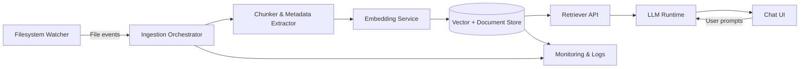

> **Documentation Priorities**
> 1. Maximize LLM understanding
> 2. Maximize LLM strengths (pattern recognition, consistency, exhaustive reasoning)
> 3. Minimize LLM weaknesses (ambiguity, hidden context, state drift)
> 4. Optimize for LLM context efficiency
> 5. Human readability is secondary

# Design: Local Chat UI with Live Knowledge Base

## Architecture Overview
The solution consists of modular components enabling a local chat interface backed by a live knowledge base that updates as files change.

## Component Descriptions
- **Filesystem Watcher**: Observes configured root folder for create/update/delete events using OS-native APIs (e.g., `watchdog`).
- **Ingestion Orchestrator**: Coordinates batching, debouncing, and prioritization of file processing tasks.
- **Chunker & Metadata Extractor**: Splits documents into retrieval-friendly chunks, captures metadata (path, timestamps, tags), and handles transcript/video preprocessing.
- **Embedding Service**: Generates embeddings using local GPU/CPU-friendly models; supports model hot-swapping.
- **Vector + Document Store**: Persists embeddings and raw references (e.g., SQLite/duckdb + FAISS/Qdrant).
- **Retriever API**: Serves retrieval queries with filter support and returns citations for the chat UI.
- **LLM Runtime**: Hosts chosen local/free LLM (e.g., llama.cpp, text-generation-webui, or OpenAI-compatible adapter).
- **Chat UI**: Presents conversational interface, streaming responses, citation display, and knowledge refresh indicators.
- **Monitoring & Logs**: Aggregates ingestion status, errors, and performance metrics for operators.

## Data Flows
1. Filesystem watcher emits events for changed files and enqueues them for ingestion.
2. Ingestion orchestrator debounces rapid updates, extracts content (including optional transcription), and chunks documents.
3. Embedding service encodes chunks and writes results to the vector/document store with metadata.
4. Chat UI sends user prompts to the retriever, which fetches relevant chunks and streams them to the LLM runtime.
5. LLM runtime generates grounded responses, returning citations for display in the chat UI.
6. Monitoring surface displays ingestion throughput, indexing errors, and storage growth.

## Technology Considerations
- **LLM Hosting**: Prioritize llama.cpp-compatible GGUF models using the RTX 3060 GPU; evaluate vLLM/text-generation-webui as alternatives.
- **Embeddings**: Consider `text-embedding-3-small` equivalents via open models (e.g., `all-MiniLM-L12-v2` with sentence-transformers) optimized for CPU/GPU balance.
- **Vector Store**: Use local-first stores (FAISS, Qdrant, Chroma) with incremental update support.
- **Watcher**: Leverage Python `watchdog` or Rust `notify` for cross-platform filesystem monitoring.
- **Transcription**: Integrate Whisper.cpp or faster-whisper for local speech-to-text when ingesting video/audio.
- **Chat UI**: Implement with React/Vite or similar, communicating with backend via WebSocket/REST streaming APIs.

## Deployment Model
- Backend services orchestrated via Python (FastAPI) or Rust/Node servers, packaged with local runtime scripts.
- Chat UI served locally (e.g., Vite dev server / production build) with reverse proxy for API endpoints.
- Vector store and embedding artifacts stored on local disk or NAS (`z:/`), with scheduled backups.
- Optional GPU acceleration enabled through CUDA for both LLM and transcription workloads.
